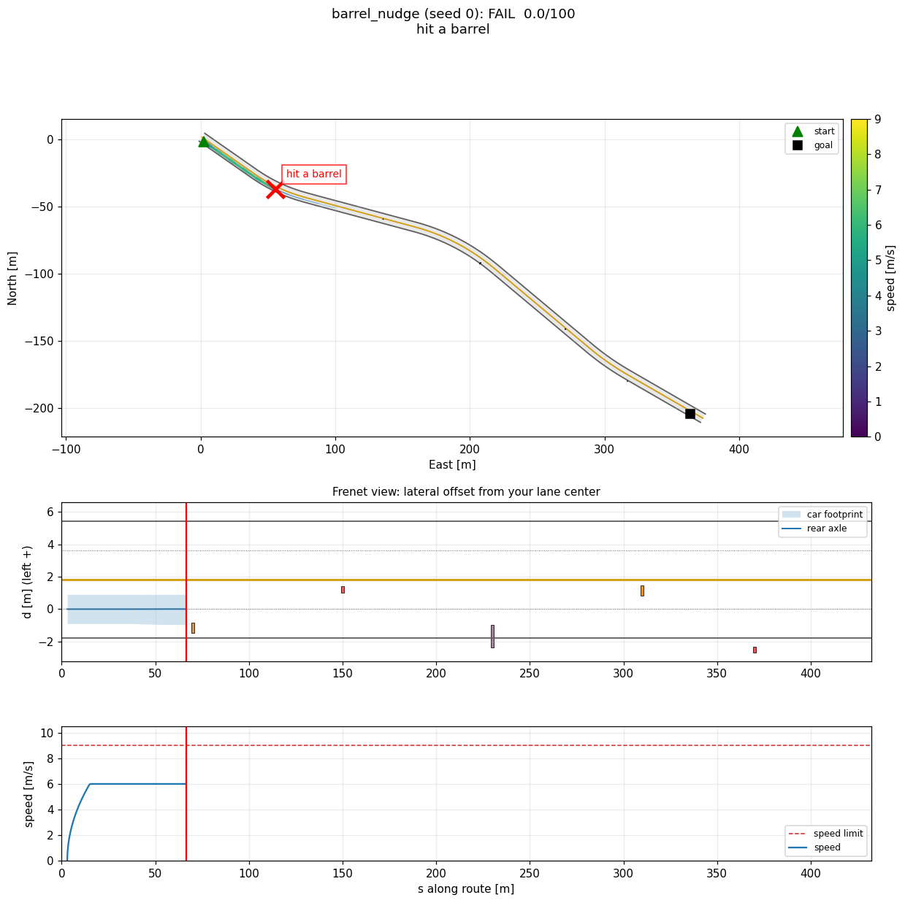

# Local Planning

**Level:** intermediate. **Time:** core in an afternoon, stretch as long as you like.

Our car's autonomy stack has three layers on the control side. The **HD map route** says which roads to take. The **mid planner** looks at that route plus what perception sees right now and decides where the car should actually drive for the next few seconds: where in the lane, how fast, and when to stop. The **MPC** then turns that plan into throttle, brake and steering.

```
HD map route  ──►  mid planner (you)  ──►  ReferenceTrajectory  ──►  MPC  ──►  car
                        ▲
    perception ─────────┘  (obstacles, traffic lights, pedestrians)
```

<p align="center"><br>
<em>The starter on <code>barrel_nudge</code> before any part is done: it drives down the middle of the lane and into the first barrel. Part 3 fixes that.</em></p>

In this challenge you write the mid planner. Ten times a second it gets the car's state, the map and noisy perception, and returns a trajectory: a list of points to drive through and a speed for each. A perfect controller follows your trajectory for 0.1 s, then asks again. We grade what the car actually did.

The **core** is a guided walkthrough in four parts. Most of the planner is already written; you fill in three functions, and each one has a checkpoint that tells you when it is right. The **stretch** is open-ended: harder scenarios (a work zone, traffic lights, pedestrians) with no step-by-step guide.

> **Try each part yourself first.** Use AI to explain a concept or to help you debug, not to write your solution. The checkpoints tell you when you are right.

If this is your first robotics project, the **Speed Control** and **Route Planning** challenges are gentler places to start.

## Setup

```bash
pip install -r requirements.txt       # from the repo root: numpy and matplotlib, that's all
python local_planning/check.py        # checkpoints (Parts 1 to 3 say TODO at first; Part 4 drives the scenarios)
python local_planning/run.py          # drives every scenario and prints a scoreboard
```

You only edit [`planner.py`](planner.py). It runs as shipped: until you write a part, the planner falls back to something naive (6 m/s, middle of the lane, ignores stop signs), and `run.py` tells you which parts are still missing. Every run writes a plot per scenario into `local_planning/results/`; a full run (no `--scenario`) also writes `summary.json` and `scoreboard.md` there.

### How the planner fits together

Every 0.1 s, `Planner.plan` (already written, at the bottom of `planner.py`) does this:

```
perception ─► ObstacleMemory ─► obstacles ────► Part 3: choose_offset ─► d(s) ─┐
                                                                               ├─► build_trajectory ─► car
map ─► Part 2: StopSignLogic ─► stop point ─► Part 1: speed_profile ─► v(s) ───┘
```

Words you will see everywhere:

- **Frenet coordinates.** `s` is the distance along your lane's centerline, `d` is how far you are to the side of it (positive = left). Your lane is `d` from -1.8 to +1.8 m. A barrel "0.9 m into the lane from the right" has its inner edge at `d = -0.9`.
- **Stations.** The plan is a list of `s` values, one every 0.5 m from the car to 50 m ahead. For each station you choose a sideways offset `d` (Part 3) and a speed `v` (Part 1).
- **The car.** Its position is the center of its **rear axle**. The front bumper is 3.7 m ahead of that, the rear bumper 0.8 m behind, and it is 1.8 m wide.

## Part 1: How fast? (`speed_profile`)

A good speed plan obeys four limits at once: the speed limit, curves (going around a curve pushes you sideways; too fast is uncomfortable, then dangerous), how hard you may speed up or slow down, and stop points where the speed must be zero. The catch is that limits ahead of you affect you now: at 9 m/s you need about 20 m to stop comfortably, so you must start braking long before the stop line.

The classic trick is **two passes** over the stations:

```
speed
 10 ┤   ____________                ____________
    │  /            \              /            \
  4 ┤ /              \____________/              \
    │/                  the curve                 \
  0 ┼──────────────────────────────────────────────● stop
    car                                               s ──►
```

The **forward** pass walks from the car ahead and never lets you speed up faster than `ACCEL`: it draws the `/` ramps. The **backward** pass walks from the far end back to the car and never lets you arrive anywhere faster than you could still slow down from: it draws the `\` ramps. Take the smaller of the two at every station.

**Do it:** fill in `speed_profile` in `planner.py`. Its docstring lists the exact rules and walks you through the steps.

**Check it:** `python local_planning/check.py part1` runs seven small tests: starting from a standstill, a stop line ahead, a tight right turn, a speed limit that drops, uneven station spacing, standing at a stop point, and a stop you are too close to make comfortably. Then `python local_planning/run.py --scenario curvy_road` should pass with a better score than before.

**Explain in your own words** (in your write-up):
1. Why does the backward pass start at the far end of the plan instead of at the car?
2. You are doing 9 m/s and a curve with a 15 m radius starts 20 m ahead. How fast may you take it (`A_LAT_MAX = 1.5`), and does `DECEL = 2.0` give you enough room to get there?

## Part 2: Stop signs (`StopSignLogic`)

The rule at a stop sign: the car has to be fully stopped (below 0.05 m/s) for 3 seconds with its front bumper within 4 m of the line, and only then may it go. Aim for about 1 m before the line; stopping more than 3 m back costs points. That needs memory across ticks, which makes it a small **state machine**:

```
APPROACHING ──(stopped close to the line)──► HOLDING ──(3 s)──► DONE
     ▲                                          │
     └────────────(started moving again)────────┘
```

Each tick, `StopSignLogic.update` returns where the car should stop (the rear axle's `s`), or `None` when no stop sign needs you. The planner passes that stop point to your Part 1, which handles the braking.

**Do it:** fill in `StopSignLogic` in `planner.py` (docstring has the details and hints).

**Check it:** `python local_planning/check.py part2` runs five tests: a stop point 0 to 3 m before the line, a real 3 s hold after a slow creep up to the line, driving on afterward (and stopping for the next sign), a stop made too far from the line (it must not count), and creeping forward in the middle of a stop (the count starts over). Then `run.py --scenario stop_sign` should pass.

**Explain in your own words:**
1. Why do you need to remember which stop signs are done?
2. What should happen if the car stops 10 m before the line because something was in the way, and why?

## Part 3: Around the barrels (`choose_offset`)

On `barrel_nudge`, barrels and cones stick partway into your lane. You cannot change lanes (there is a double yellow), but there is room to squeeze past inside your lane. In the Frenet view it looks like this:

```
 d
+1.8  ═══════════════════════════════════════════   double yellow
                       ________________
 0.0  ────────────────/                \─────────   your offsets d(s)
                        [barrel]
-1.8  ───────────────────────────────────────────   edge line
                                                s ──►
```

Think of the car as a 4.5 x 1.8 m rectangle sliding along your `d(s)`. While any part of it is beside the barrel you want at least 0.5 m of gap, you must never put a wheel over a line (keep the car's center within 0.7 m of the lane center: that leaves about 0.2 m to spare for the corners), and you want to shift over smoothly and come back to the middle afterward. `tools.py` gives you two things that make this much easier:

- `ObstacleMemory` (already wired in) remembers every obstacle perception has seen, in Frenet coordinates (`s_min`, `s_max`, `d_min`, `d_max`), even after the camera loses sight of it while you drive past.
- `lateral_transition(s, s_begin, s_end, d_from, d_to)` is a smooth S-shaped shift. Two of them make a nudge: over, then back. `transition_length` tells you how long a shift must be to stay comfortable at a given speed.

**Do it:** fill in `choose_offset` in `planner.py`.

**Check it:** `python local_planning/check.py part3` runs seven tests: an empty road, a barrel on the right, a cone on the left, things Part 3 should ignore, two barrels far apart, the same barrel planned again after the car has moved on (the plan must not slide with the car), and a check that a 5 cm wobble in a barrel's position does not make your plan jump. Then `run.py --scenario barrel_nudge` should pass.

**Explain in your own words:**
1. Why tie the shift to the barrel's position instead of to the car's position?
2. A barrel reaches 0.9 m into your lane from the right. What offset do you drive at while passing it, and how long should the shift be at 9 m/s?

## Part 4: Put it together

```bash
python local_planning/check.py part4    # drives the three core scenarios with your whole planner
python local_planning/run.py            # every scenario, plus plots in local_planning/results/
```

| Core scenario | What it tests |
|---|---|
| `curvy_road` | Part 1: curves, a 6 m/s school zone, a smooth start and stop at the goal |
| `stop_sign` | Parts 1 and 2: a full 3 s stop, then a tight right turn |
| `barrel_nudge` | Parts 1 and 3: four obstacles sticking into the lane, passed inside the lane; a cone on the shoulder to ignore |

If all three pass, you have a working mid planner: that is the core. Look at the plots in `results/`. The middle panel (the Frenet view: your sideways offset along the route, with obstacles and lane lines) is usually the most useful one.

## Stretch

The stretch scenarios are open-ended: no TODOs, no checkpoints, no hints about how. Change anything in `planner.py` you like.

| Stretch scenario | What it tests |
|---|---|
| `barrels` | Two same-direction lanes; a cone cluster blocks yours, so you change lanes (allowed over a dashed white line) and come back |
| `road_work` | A work zone blocks your lane on a two-way road: pass only inside the dashed-yellow passing zone, and be back before the double yellow |
| `road_closed` | Same road, but no passing allowed: stop behind the closure (5 s stopped 0 to 10 m behind it ends the run; the real stack would reroute here) |
| `traffic_light` | A light turns yellow as you approach (stop or go?), then a red that turns green. The color detector flickers |
| `crosswalk` | Yield to a pedestrian who starts crossing; do not stop for one who is just standing on the curb |
| `gauntlet` | All of the above in one 600 m drive |

What makes them hard, and what you will need:

- **Lane-line rules.** `route_map.crossable('left', s)` tells you where the left line may be crossed. The whole maneuver, including the part of the car still crossing back, has to fit inside that stretch.
- **Deciding when you cannot pass.** Sometimes the right answer is to stop and wait.
- **Traffic lights.** Their color comes straight from the detections (`ObjClass.TRAFFIC_LIGHT`, color in `custom_classification`: 1 red, 2 yellow, 3 green). About 3% of frames report the wrong color; `Debouncer` helps. On a yellow you must decide: can you stop comfortably, or will you be through before it turns red?
- **Pedestrians.** `ObstacleMemory` estimates their velocity (`vs`, `vd`). Predict where they will be while you are in the crosswalk.
- **Plan stability.** Perception positions wander by about 10 cm. If your plan jumps every time a barrel's estimate moves, the car's steering wheel twitches, and you lose points. Handling this well is at the top of our own planner's wishlist, so we care about how you do it.

`--seed N` moves obstacles, changes light and pedestrian timing, and changes the noise. **We grade on seeds you have not seen**, so do not tune to seed 0.

## Reference

### What the planner is given

`Planner.__init__(route_map)` gets the map, which never changes:

| Field | Meaning |
|---|---|
| `reference` | Centerline of your lane, a `common.geometry.Polyline`. `reference.project(x, y)` gives `(s, d, index)`; `reference.frenet_to_xy(s, d)` goes back. |
| `lane_width` | 3.6 m. |
| `left_lane` | `None`, `'same_direction'` or `'opposite_direction'`. If it exists it spans `d` from +1.8 to +5.4. |
| `lane_lines`, `crossable(side, s)` | The line between the lanes along `s` (`'dashed_white'`, `'dashed_yellow'`, `'double_yellow'`, ...). Dashed lines may be crossed; the right edge line and the far edge of the left lane never. |
| `speed_limit_at(s)` | Speed limit [m/s] at `s`. |
| `stop_lines` | `StopLine(id, s, kind)`, kind `'stop_sign'`, `'traffic_light'` or `'crosswalk'` (crosswalks also have `crosswalk_s_start` and `crosswalk_s_end`). |
| `goal_s` | Where to stop at the end. You are done once you are stopped within 3 m of it. |

`Planner.plan(obs)` gets `obs.t` (time), `obs.ego` (the car: `x, y` of the rear axle, speed `v`, heading `psi`) and `obs.objects.objects` (detections, in the vehicle frame measured from the front bumper; `ObstacleMemory` converts them for you). Perception is realistic, so imperfect: about 45 m of range and a 120 degree field of view, positions noisy by about 10 cm, sizes by a few percent, and any object can be missed for a frame. Use only the map and the observation: no reading the simulator's ground truth in `sim/`.

It returns a `ReferenceTrajectory`: points with position, heading, speed, curvature and time, starting at the car. `build_trajectory` fills all of that in for you.

**The ideal follower.** Each tick the car moves along the returned trajectory for exactly 0.1 s, at the speeds you asked for. It follows that geometry perfectly, even things a real car cannot do, which is why the grader checks the path the car actually drove: a kink or jump in your plan shows up as "impossible steering". (`build_trajectory` eases the first 5 to 10 m from where the car actually is into your offsets. When the car is already on your offsets, which is the normal case, that changes nothing.) If a plan is unusable (an exception, NaN, points more than 1 m apart, or it ends while you are still moving) the car brakes at 5 m/s² and that tick counts against you.

### Toolbox (`tools.py`)

| Tool | What it does |
|---|---|
| `ObstacleMemory()` | `update(obs, route_map)` returns every remembered obstacle with world position, size, Frenet extents `s_min, s_max, d_min, d_max`, class, and (for pedestrians) velocity `vs, vd`. Averages out the noise and keeps static objects after they leave the field of view. |
| `lateral_transition(s, s_begin, s_end, d_from, d_to)` | Smooth S-shaped change of `d` between `s_begin` and `s_end`. |
| `transition_length(delta_d, speed)` | How long a shift of `delta_d` must be to stay under 1.5 m/s² of sideways acceleration at `speed`. |
| `stations(s0, length, stop_s)` | Stations every 0.5 m from `s0`; if `stop_s` is within reach, the last station is exactly `stop_s`. |
| `path_curvature(route_map, s, d)` | Curvature of the path your offsets make (curves in the road plus your own swerves). |
| `build_trajectory(route_map, s, d, v, ego)` | Makes the `ReferenceTrajectory`: starts at the car, eases into your offsets over the first 5 to 10 m if the car is not already on them, fills in heading, curvature and time. |
| `Debouncer(frames_on, frames_off)` | A yes/no signal that ignores flicker, for example "the light is red". |
| `detection_to_world(ego, det)` | One detection from the front-bumper frame to world coordinates. |

### Rules (any of these is a FAIL, score 0)

| Rule | Details |
|---|---|
| Hit something | Any overlap between the car (4.5 x 1.8 m) and an obstacle or pedestrian. |
| Cross a line you may not | Any part of the car more than 5 cm past the right edge line, a double yellow or solid line, or the far edge of the left lane. |
| Run a red light | Front bumper crosses a traffic-light stop line while the light is red. Yellow is legal. |
| Roll a stop sign | Front bumper crosses the line without first being stopped (below 0.05 m/s) for 3 s with the bumper within 4 m of the line. |
| Fail to yield | Any part of the car inside the crosswalk while a pedestrian is in your lane or within 1 m of it. |
| Impossible steering | Driven path curvature above the car's limit (usually a kink or a jump in your plan). |
| Timeout | Not at the goal within the scenario time limit. |
| Broken plans | More than 5% of ticks with an unusable plan. |

### Scoring

A run that passes starts at 100 and loses points for the items below; each is capped so one habit cannot zero a run. The scoreboard shows your top penalties, and `results/summary.json` has every metric.

| Penalty | Free up to | Cap |
|---|---|---:|
| Lateral acceleration | 2.0 m/s² | 15 |
| Longitudinal acceleration | +2.0 / -3.0 m/s² | 15 |
| Jerky speed changes (RMS jerk) | 3.5 m/s³ | 10 |
| Steering faster than the car can (curvature rate) | 0.2 1/(m s) | 10 |
| Clearance to obstacles | 0.5 m | 20 |
| Speeding | limit + 0.3 m/s | 15 |
| Slower than par (20% slower than our reference planner) | par time | 15 |
| Plan instability: how much your plan moves sideways between ticks (5 to 30 m ahead) | 5 cm average | 15 |
| Plan does not start at the car | 0 | 10 |
| Unusable plans (emergency stops) | 0 | 10 |
| Off lane center with nothing in the lane nearby | 0.5 m | 10 |
| Stopping more than 3 m before a stop line (6 m behind the closure) | 3 m | 10 |
| Stopping for a pedestrian who is not crossing | none | 10 |

For calibration: the starter as shipped passes 1 of the 3 core scenarios (`curvy_road`, about 91). Filling in the three parts the straightforward way the docstrings describe passes all three core scenarios on all 100 seeds we tried, scoring 99 or more every time, and none of the stretch ones. Our own planner passes all nine.

## Tips

- Do the parts in order and run the checkpoint after each one. Part 1 alone makes `curvy_road` good.
- Look at the Frenet plot after every change. Most bugs are obvious there.
- Print things. `obstacles` in `Planner.plan` is a good place to start; there is a commented-out print.
- Your planner should run well under 100 ms per call; the real one runs at 10 Hz. The scoreboard warns you if you are slow.

## What to write up for this challenge

Submission instructions are in the [top-level README](../README.md#what-to-submit). In your `WRITEUP.md`, for this challenge, include:

1. Your answers to the "explain in your own words" questions from Parts 1 to 3.
2. **One thing that went wrong** and how you found and fixed it, with a plot (before and after is ideal).
3. Your scoreboard. If you tried stretch scenarios: your approach, and which ones you did not get and why.
4. What you would do with another week.
