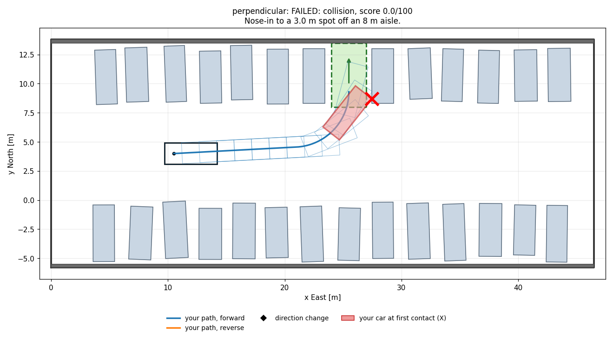

# Parking

**Level:** advanced (the guided core is intermediate). **Time:** core in an afternoon, stretch as long as you like.

**Plan the path into the spot.** In June 2026 our car learned to park itself at the end of a route. Today it does that by driving a path that a person surveyed by hand, forward only (the config file literally says "EXAMPLE, replace with surveyed points"). Nothing on the car *plans* the path into the spot. That is what you will build: a planner that looks at the lot and works out how to get in.

The core is a guided walkthrough in four parts, each with checkpoints that tell you when you are right. The stretch is open-ended: backing up, tight spots, real search.

> **Try each part yourself first.** Use AI to explain concepts or to help you debug, not to write your solution. The checkpoints tell you when you are right.

<p align="center"><br>
<em>What the starter does before you write anything: it drives the shortest forward path straight at the spot, and the front corner swings into the neighbor's car (the red car is where it first touches, the X is the contact). By Part 3 you will have fixed this.</em></p>

## Setup

```bash
pip install -r ../requirements.txt
python check.py        # the checkpoints (everything says TODO at first)
python run.py          # the scenarios (the starter already parks in empty_lot)
```

| File | What it is |
|---|---|
| `planner.py` | **The file you edit.** Parts 1 to 3 are functions marked TODO, each with a docstring that explains the idea, the inputs and outputs, and hints. The glue at the bottom is already written. |
| `check.py` | Checkpoints: `python check.py part1` (or `part2`, `part3`, `part4`, or nothing for all). |
| `run.py` | Runs every scenario, prints a scoreboard, saves a plot per scenario in `results/`. |
| `tools.py` | The toolbox (see [Toolbox](#toolbox) below). |
| `sim/` | The lots and the grader. You should not need to edit anything here. |

Until a part is written, the glue falls back to something simple, so `run.py` always runs.

## Part 1: how the car moves

**The idea.** Hold the steering wheel still and the car's rear axle drives around a circle. The tighter the steering, the smaller the circle. We describe the steering by its **curvature**, `1 / radius`: 0 is straight, positive turns left, negative turns right. Every meter the car drives, its heading changes by `curvature` radians. Our car cannot turn tighter than a circle of about 4.7 m radius (curvature 0.214 1/m).

```
                    ^ north
                    |
                    o   after a quarter circle to the left:
                  .'    one radius ahead, one radius to the left, facing north
               .'
  o ------ - '          radius R = 1 / curvature
  start, facing east
```

Backing up follows the same rules with a negative distance: the car moves opposite to where it points, and with the wheels turned left the nose swings to the right.

**What to write.** `drive(pose, curvature, distance, step)` in `planner.py`: the poses of the rear axle along the way.

**Check it.** `python check.py part1`. It drives straight, turns left and right, backs up, goes around a full circle, checks that you use the `step` you are given, and makes sure you accept full lock but refuse anything tighter.

**Explain in your own words** (for your write-up):
1. Start at (0, 0) facing east and drive 10 m at full lock to the left. Work out by hand where the rear axle ends up and which way the car faces, then check your answer with `drive()`. Show your working.
2. From the same start, back up 3 m at full lock with the wheels turned left. Sketch the path. Where does the rear axle go, and which way is the nose pointing at the end? Why?

You will use `drive()` again in the stretch part, to build maneuvers that back up.

## Part 2: is a path safe?

**The idea.** The car is a 4.5 m x 1.8 m rectangle, not a point. The rear axle sits 0.8 m from the back bumper and 3.7 m from the front one. So the rear axle can be a meter from a parked car while the front corner is already scraping it. Check the whole rectangle, at every pose, and between poses too, because a corner moves a lot when the car turns.

```
                  +----------+
                  |  parked  |
  +---------------+---+ car  |    the rear axle (o) is nowhere near the parked car,
  | o                 |      |    but the front corner is already inside it
  +---------------+---+      |
                  +----------+
```

**What to write.** `path_is_free(problem, x, y, yaw)` and `min_clearance(problem, x, y, yaw)`. They are short: the toolbox's `FastChecker` does the geometry. The point of this part is knowing what to check.

**Check it.** `python check.py part2`. It includes a path whose rear axle stays well clear of a parked car while the side of the car overlaps it, and a path of just two poses that drives straight through a car in between.

**Explain in your own words:**
1. In `perpendicular`, find a pose where the rear axle is at least 1 m from every obstacle but the car still collides (`problem.collides` will tell you). Give the pose, and say which part of the car touches what.
2. Give two poses, both collision-free, where driving straight from one to the other hits something in between. How far apart are they, and what did you change so your `path_is_free()` catches it?

## Part 3: find a path into the spot

**The idea.** A **Dubins path** is the shortest way for a car that only drives forward to get from one pose to another: a turn, a straight (or another turn), and a turn, all at the tightest radius. `dubins_path(start, goal)` in the toolbox computes it, but it does not know about obstacles. In the picture above, it turns in too sharply and the car's front corner swings into the neighbor.

The fix is to go somewhere else first. Pick a **staging pose** in the open aisle (for example, over on the far side, already angled toward the spot), drive there, then drive into the spot from there. `staging_candidates(problem)` gives you a few hundred collision-free poses to try. For each one, make two Dubins paths (start to staging, staging to spot), keep the pair if both are free, and return the best one you find.

**What to write.** `plan_path(problem)`: the docstring walks you through it step by step.

**Check it.** `python check.py part3`. It plans in `empty_lot`, `perpendicular` and `angled` and runs your path through the real grader.

**Explain in your own words:**
1. Why does the direct Dubins path hit the neighbor in `perpendicular`? Your plot draws it as a gray dashed line, with the car outlined in red dashes where it first hits something. Which corner of the car hits, and why that one?
2. Print (or plot) the staging pose your planner picks in `perpendicular`: x, y and heading. Where is it compared with the spot, and why does the path through it clear the neighbor when the direct one does not?

## Part 4: put it together

`python run.py` runs all the scenarios. The three **core** scenarios can all be done driving forward only:

| Scenario | What it is |
|---|---|
| `empty_lot` | Warm-up: nose-in with no neighbors and a 10 m aisle. The starter already passes it. |
| `angled` | Nose-in to a 60 deg angled spot off a 6 m one-way aisle |
| `perpendicular` | Nose-in to a 3.0 m spot between parked cars, off an 8 m aisle. The car on the right is parked a little close. |

`python check.py part4` runs the core on three layouts each. Try other layouts with `python run.py --seed 4`: **we grade on layouts you have not seen**, so do not tune your planner to seed 0. Then look at `results/*.png`, and try to raise your score (see [Scoring](#scoring)): shorter paths and more clearance both help.

## Stretch: back up

The **stretch** scenarios need more than one forward move. This part is open-ended: there is no template and no checkpoint.

| Scenario | What it is |
|---|---|
| `around_the_row` | The only free spot is on the far side of a double row of cars. Drive around the end of the row first. |
| `parallel` | Parallel park into a 7 m gap at the curb. You have to back in. |
| `back_in` | Back into a perpendicular spot so the car faces the aisle. |
| `tight_aisle` | Nose-in to a 2.6 m spot off a 6 m aisle. On about half the layouts one forward move fits if you end deep in the spot; on the rest you have to back up and try again. |
| `cluttered` | The perpendicular lot with cones, a shopping cart and a person in the aisle |

Three ways in, from simplest to strongest:

1. **By hand.** Build maneuvers from your `drive()` with negative distances: a human parallel parks with about two arcs in reverse. Great for understanding, fragile across layouts.
2. **Hybrid A\*.** Search over poses, expanding short forward and backward arcs. This is what real parking planners use:
   ```
   open = priority queue holding the start pose with cost 0
   while open is not empty:
       pose = the pose in open with the smallest (cost so far + estimate of cost to go)
       if a direct path from pose to the goal is collision-free: stop, you are done
       for steering in (full left, half left, straight, half right, full right):
           for direction in (forward, backward):
               next = drive(pose, steering, 1 m in that direction)
               if that move is collision-free and next lands in a grid cell (x, y, heading)
                  you have not reached more cheaply:
                   add next to open with cost = cost(pose) + length
                                                  (+ extra for reversing, for changing direction)
   ```
3. **Reeds-Shepp curves.** The Dubins idea for a car that can also reverse: the shortest path between two poses when backing up is allowed. Great as the "direct path" in step 3 of Hybrid A\*.

Tell us in your write-up which you tried and what broke.

## Toolbox

Everything in `tools.py`. A "pose" is `(x, y, yaw)` or anything with `.x .y .yaw` (like `problem.start`).

| Tool | What it does |
|---|---|
| `dubins_path(start, goal)` | Shortest forward-only path between two poses, as a `Path` with arrays `.x .y .yaw` (every 5 cm), `.length`, `.end`. Ignores obstacles. `None` if there is none. |
| `dubins_paths(start, goal)` | All the forward-only Dubins paths, shortest first (when the shortest hits something, another might not) |
| `get_checker(problem)` | A `FastChecker` for this lot, built once and reused |
| `checker.collides(x, y, yaw)` | One True/False per pose: does the car's rectangle touch anything or leave the lot? Exact, and fast for thousands of poses. |
| `checker.path_is_free(x, y, yaw)` | True if the whole path is clear, also checking between your poses every 2.5 cm |
| `checker.clearance(x, y, yaw)` | Distance from the car to the nearest obstacle, per pose: 0 wherever the car touches something, otherwise within about 0.1 m |
| `staging_candidates(problem, n)` | Up to `n` collision-free poses in the open part of the lot, nearest to the spot first, many of them pointing toward it |
| `join(p1, p2, ...)` | Glue paths end to end (each must start where the previous one ended) |
| `to_segments(x, y, yaw)` | What `plan()` must return: splits the path wherever it changes direction and spaces the points correctly. The glue in `planner.py` already calls it. |
| `problem.spot.goal_pose()` | The rear-axle pose that parks the car exactly centered in the spot |
| `problem.collides_many(...)`, `problem.clearance_many(...)` | Exact versions of the checker functions (slower) |

## Conventions (read these, they bite)

| Thing | Convention |
|---|---|
| World frame | Local ENU: `x` = East, `y` = North, meters |
| Pose position | Center of the **rear axle** |
| `yaw` | Where the car's **nose** points: 0 = East, counter-clockwise positive. Also when backing up. |
| Curvature, steering | Positive = turning left |
| Output | A list of `ReferenceTrajectory` segments (`common/messages.py`, the same message our MPC uses), one per direction of travel, with `reverse=True` on the segments driven backward. `to_segments()` builds this for you. |

## Rules

Any of these fails the scenario (score 0). If you build your output with `to_segments()`, the format rules take care of themselves.

| Rule | Details |
|---|---|
| Valid output | A non-empty list of `ReferenceTrajectory`, each with at least 2 points, no NaN, points at most 0.5 m apart |
| Starts at the start | First point within 0.10 m and 3 deg of `problem.start` |
| Connected | Each segment starts where the previous one ended (within 1 cm and 0.5 deg). A direction change happens at one pose. |
| Drives like a car | Consecutive segments that go the same way count as one. Over every 0.5 m of it (or all of it, if it is shorter), the car moves within 4 deg of `yaw` (forward) or `yaw + 180 deg` (reverse). No sliding sideways, however short the piece. |
| Steerable | Over any 0.5 m of travel, forward and backward added up and across direction changes, the heading changes no faster than 0.221 1/m (the car's limit plus 3%). The car cannot turn while standing still. |
| No contact | The car never touches an obstacle or leaves the lot (checked every 0.05 m) |
| Parked | The whole car ends inside the spot, heading within 5 deg of the spot's |
| In time | `plan()` returns within 30 s |

## Scoring

A plan that passes every rule earns up to 100 points:

| Metric | Points | Full points | Zero points |
|---|---|---|---|
| Path length / par length | 30 | 1.05 | 2.0 |
| Direction changes | 15 | at or below par | minus 5 for each extra |
| Minimum clearance along the path | 20 | 0.30 m | 0.05 m |
| Parked off-center (car center to spot centerline) | 10 | 0.10 m | 0.45 m |
| Final heading error | 10 | 1 deg | 5 deg |
| Steering in place | 5 | none | minus 1 for each |
| Planning time | 10 | 2 s (core), 5 s (stretch) | 20 s (core), 25 s (stretch) |

**Steering in place** is a jump in curvature of more than 0.08 1/m within 0.5 m of travel, anywhere but a direction change: a real car would have to stop to turn the wheel that fast. Where a Dubins turn meets its straight counts (so a two-Dubins path usually loses a few of these 5 points). A clothoid, where the curvature changes gradually, does not. Par lengths and direction changes are in `PAR` in `sim/scenarios.py`; they come from our own planner with a little slack.

To calibrate yourself: the starter parks in `empty_lot` only (core average 32.7). Parts 1 to 3 written the straightforward way pass all three core scenarios on every layout we tried (core average 88.3 on seed 0, individual scenarios 75 to 98 across twenty layouts) in well under a second each. Our own Hybrid A\* with Reeds-Shepp paths passes every scenario (core 97.0, stretch 90.9 on seed 0), and a tester's own pure-Python Hybrid A\* scored core 96.7, stretch 80.8. `tight_aisle` is hard on clearance for everyone, so a pass in the 70s there is a good result.

## Running

```bash
python run.py                          # all scenarios, seed 0, prints the scoreboard, writes results/
python run.py --scenario parallel      # one scenario (repeat the flag for more)
python run.py --seed 4                 # a different layout
python run.py --no-plot                # faster
python check.py part3                  # one checkpoint group (exits 0 only if every check passes)
```

A run of only some scenarios (`--scenario`) updates their plots but leaves `results/summary.json` and `results/scoreboard.md` from your last full run alone. When your code raises, the scoreboard shows the error with your file and line, and the full traceback is in `results/summary.json`.

## What to put in your write-up

Along with the general items in the [top-level README](../README.md#what-to-submit):

* Your answers to the "explain in your own words" questions from Parts 1 to 3.
* One scenario or layout that broke your planner, the plot that showed it, and what you changed.
* Your results on a few seeds other than 0.
* If you tried the stretch: which approach, and how far you got.

## Tips

* The car cannot turn tighter than a 4.66 m radius at the rear axle, and its front corners swing much wider than that (about 6.7 m at full lock).
* In reverse, `yaw` is still the nose direction. Your `drive()` with a negative distance already handles it.
* A path that scrapes by at 2 cm is legal but scores badly. When you have several free paths, prefer the one with more clearance unless it is much longer.
* Plot early. Most bugs are a sign error you can see in one picture.
