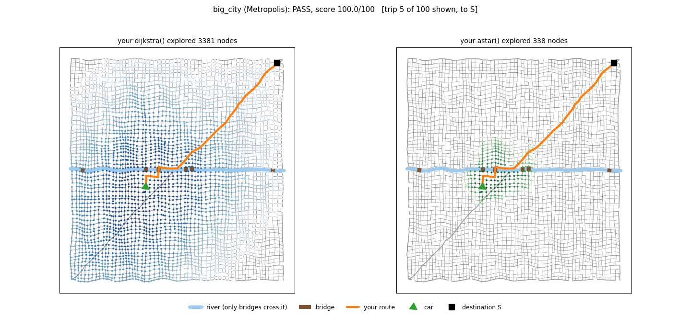

# Route Planning

**Level:** beginner. **Time:** a few hours for the core.

**Get the car across town.** When an operator picks a destination on our car, a letter from A to Z, our **high planner** finds the route. It answers a ROS 2 service called `GetShortestPath` (start position and heading, goal position and heading) with an `HLPath`, the list of waypoints the rest of the stack then follows. When the road ahead turns out to be blocked, the car marks that piece of road as unusable and asks the high planner for a new route from wherever it is now. On the car all of this runs on an HD map of lanes. Here it runs on a small synthetic town, and you write the search.

You need to know basic Python (lists, dicts, loops, functions). You do not need to have seen graph search before: that is what this challenge teaches.

> **Try each part yourself first.** Use AI to explain a concept or help you debug, not to write your solution. The checkpoints (`python check.py`) tell you when you are right, and figuring it out is the point.

<p align="center"><br>
<em>One trip (big_city, trip 5), searched two ways. Dijkstra (left) does not know where the goal is, so it explores in every direction. A* (right) heads toward the goal. This trip is a good case for A*, which looks at a tenth of the nodes; on a typical trip it looks at a quarter to a half as many. The blue band is a river: roads cross it only on the brown bridges. You will make both of these pictures (<code>python run.py --scenario big_city --trip 5</code>).</em></p>

## Setup

```bash
pip install -r ../requirements.txt     # numpy and matplotlib
python check.py                        # checkpoints for every part
python run.py                          # the full scenarios, prints a scoreboard, writes results/
```

You only edit **`route_planner.py`**. Each part is one function marked `TODO`, with a docstring that explains what to do.

## The town

```python
town.nodes          # {node_id: Node(id, x, y)}   intersections and mid-block points, meters
town.edges          # [Edge(id, start, end, length, speed_limit, street), ...]
town.destinations   # {"A": Destination(letter, node, heading, street), ...}
```

An **edge** is one lane you can drive in **one direction**, from `start` to `end`. A two-way street is two edges, one each way. A one-way street is one edge. Speed limits are in m/s: 25, 35 and 45 mph streets.

The town is read-only. Build your own structures (like the graph in Part 1) instead of changing it.

---

## Part 1: The town as a graph

A search needs to answer one question over and over: *from this node, where can I go next, and what does it cost?* An **adjacency list** answers it instantly: a dict from each node to the list of (neighbor, cost) pairs you can reach in one step.

```
  A <---> B          graph = {
  ^       |              "A": [("B", 100)],
  |       v              "B": [("A", 100), ("C", 80)],   <- A <-> B is two-way, so it
  D <---- C              "C": [("D", 100)],                 is in both lists; the other
                         "D": [("A", 80)],                  streets are one-way
                     }
```

**Implement** `build_graph(town, cost, closed)`. Every node is a key. An edge adds `(end, cost)` to its `start`'s list only. Skip closed edges. The cost is the length for `"distance"` and the driving time for `"time"`.

**Check:** `python check.py part1`

**In your write-up:** Why does a one-way street show up in only one list? Why should every node be a key, even a dead end?

## Part 2: Dijkstra's algorithm

Dijkstra finds the cheapest path by growing outward from the start, cheapest first:

1. The **frontier** holds nodes you have reached, each with the cheapest cost found so far. Start with just the start node at cost 0.
2. Take the cheapest node off the frontier. A **priority queue** (`heapq`) does this fast. The first time a node comes off, its cost is **final** ("settled").
3. If it is the goal, stop and rebuild the path from `came_from`.
4. Otherwise, for each neighbor: if going through this node is cheaper than what you knew, update its cost and `came_from`, and push it.

Why "final when it comes off, not when you first see it"? In this graph, the first way you *see* B costs 4, but there is a cheaper way through A:

```
        1       1
   S ------ A ------ B ------ G         S -> B costs 4 directly, but S -> A -> B costs 2.
    \_______________/    1              The cheapest S -> G is S, A, B, G = 3.
            4
```

**Implement** `dijkstra(graph, start, goal)`, returning `(path, cost, expanded)`, where `expanded` is how many nodes you settled.

**Check:** `python check.py part2`. After Parts 1 and 2, `python run.py` already passes `first_route`.

**In your write-up:** Explain in your own words why a node's cost is only final when it leaves the frontier. What would go wrong if some roads had a negative cost?

## Part 3: A*

Dijkstra does not know where the goal is, so it spreads out in a circle. **A\*** orders the frontier by *cost so far + an estimate of the cost still to go*, `g(n) + h(n)`, so it reaches toward the goal first.

The estimate `h` is the **heuristic**. A\* still finds the cheapest path as long as `h` never **over**estimates (it is *admissible*):

* For distance, the straight-line distance to the goal is admissible: no road is shorter than a straight line.
* For time, what is the fastest you could possibly get there? The straight-line distance at the town's highest speed limit. That can never be slower than the real trip.

**Implement** `straight_line_heuristic(town, goal, cost)` (it returns a function `h(node)`) and `astar(graph, start, goal, heuristic)`. It is your Dijkstra with one change.

**Check:** `python check.py part3` (it also watches how many nodes each one settles).

**In your write-up:** Why does A\* expand fewer nodes? Why does the time heuristic help less than the distance one? What goes wrong if `h` overestimates?

## Part 4: Plan real trips

`plan_route(town, start_pose, destination, cost, closed)` is what `run.py` calls for each trip. It returns the route: a list of node ids from the node ahead of the car to the destination. It already works after Part 2, but it has three problems, listed in its docstring. Fix them:

1. Some scenarios care about **travel time**, not distance (`cost`). The fastest route is often not the shortest.
2. Some roads are **closed** (`closed`). A route through a closed road is a failed trip.
3. Use your A\*.

The car is in the middle of a block, so your route must start at the next node ahead of it. `start_node_from_pose()` gives you that node (already in the code).

| Scenario | What it tests |
|---|---|
| `first_route` | A small town, shortest distance |
| `rush_hour` | Travel time: fast arterials beat short side streets |
| `road_closed` | Known closures, plus a new one that appears while you drive. Just like the real car, you get asked again for a route from where you are now. |

**Check:** `python check.py part4`, then `python run.py`.

**In your write-up:** In `road_closed`, what happens between the closure appearing and your new route? Your planner starts from scratch each time: when would that be too slow, and what could you do instead?

---

## Stretch (open-ended, pick any)

| Scenario | The twist | Idea to explore |
|---|---|---|
| `no_left_turn` | Left turns cost 10 s and right turns 3 s. Some intersections forbid left turns (circled in the plots), and U-turns are not allowed. | A node is no longer enough to describe where you are: the same intersection can be reached from different directions. Search over **(previous node, node)** states. Use `town.turn_allowed(u, v, w)` and `town.turn_cost(u, v, w)`, and `current_edge(town, pose)` (already imported) for the car's own first move. |
| `arrive_facing` | Destinations have a `heading` (radians, ENU: 0 = East, counter-clockwise positive). The car must arrive driving that way (within 45 deg), so it ends up on the right side of the street. The plots draw it as an arrow. | The goal becomes "reach this node along the right edge". |
| `big_city` | About 3,600 nodes and 100 trips, 20 s in total | A heap-based A\* takes well under a second. A search that scans every node for the cheapest one takes about half a minute and fails. Do you need to rebuild the graph for every trip? |

In the other scenarios `destination.heading` is `None` and the turn rules are off, so the same `plan_route` can handle everything.

## Rules and scoring

A **trip fails** (0 points) if your code raises, or if the route: does not start at the node ahead of the car, jumps between nodes that no road connects, drives a one-way street backwards, uses a closed road, does not end at the destination, makes a forbidden turn (`no_left_turn`), or arrives the wrong way (`arrive_facing`).

A valid trip earns up to **90 points** for how cheap its route is: full points when it costs the same as the best possible route, zero when it costs 25% more or worse. A scenario's score is the average over its trips, plus up to **10 points** for total planning time (full under 0.5 s, or under 3 s in `big_city`). If planning takes more than the time limit in total (20 s in `big_city`), the scenario scores 0. A scenario **passes** when every trip is valid. `--seed N` gives a different town and different trips, and **we grade on seeds you have not seen**.

The last column of the scoreboard, *A\*/Dijkstra explored*, is information, not score: run.py runs your own `dijkstra()` and `astar()` on each core trip and counts the nodes each one settles.

To calibrate yourself: the empty starter scores 0. After Parts 1 and 2, `first_route` scores 100, `rush_hour` about 50 (distance is not time), and `road_closed` fails. After all four parts the core scores 100. The stretch scenarios are where strong applicants stand out.

## What to put in your write-up

Along with the general items in the [top-level README](../README.md#what-to-submit): your answers to the "in your write-up" questions above, in your own words, and one bug you hit and how you found it.

## Tips

* `python check.py partN` is fast. Run it after every change.
* `results/<scenario>.png` shows your route and the nodes your searches settled, for trip 1. `python run.py --scenario rush_hour --trip 4` shows trip 4 instead (a run with `--scenario` updates the plots only, not `summary.json`). If A\* explores as much as Dijkstra, look at your priority.
* A node can be in the heap more than once. That is normal: skip it if it is already settled.
* `math.inf` is a good "not reached yet" cost.
* Print small things. `print(graph[start])` answers most Part 1 questions.
