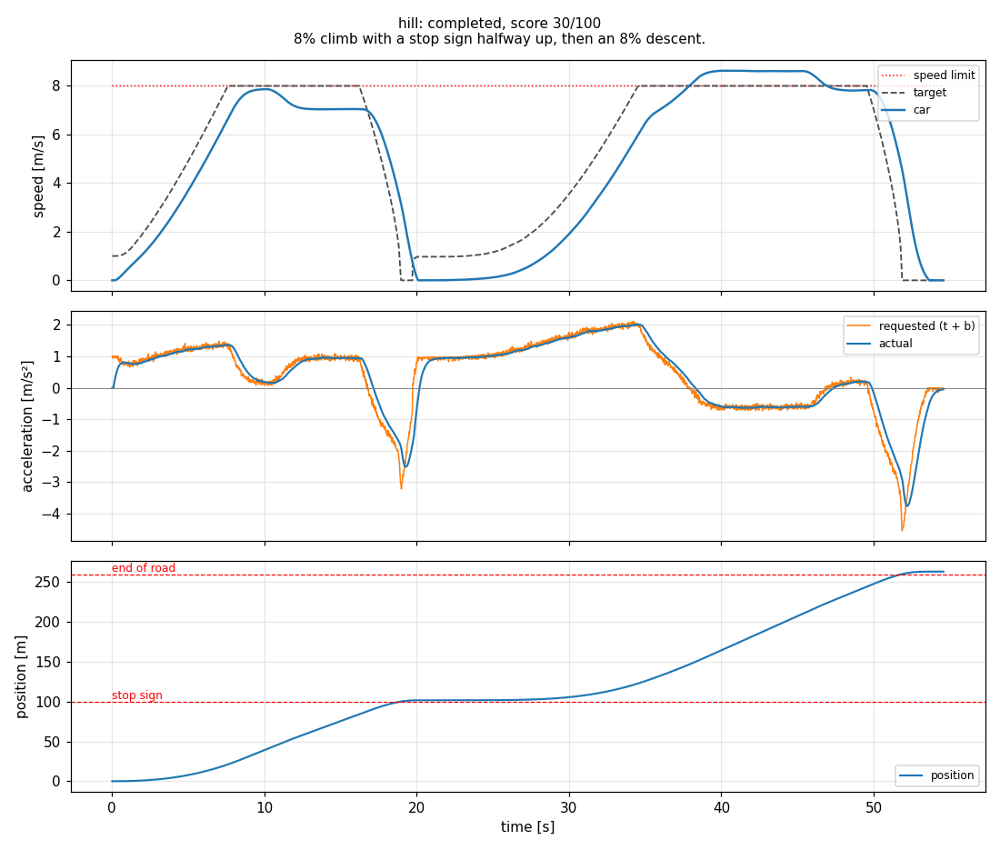

# Speed Control

**Level:** beginner. **Time:** a few hours for the core.

**Build the cruise control for our car.** Every autonomous car has to turn "the plan says 8 m/s here" into how hard to press the throttle and the brake. On our car that is part of the MPC's job. Here you build it yourself with the most widely used controller in the world: PID. You will see why each piece exists by watching the car misbehave without it.

This challenge tests control basics: feedback, integral action, feedforward, and a little kinematics. If you have written a `for` loop and a class in Python, you can do this.

> **Try each part yourself first.** Use AI tools to explain a concept or to help you debug, not to write your solution. The checkpoints tell you when you are right, and figuring it out is the fun part.

<p align="center"><br>
<em>After Part 1 (P control only) on the <code>hill</code>: the car sags on the climb, barely gets going after the stop, runs fast on the way down, and rolls past the stop sign. Parts 2 to 4 fix each of these.</em></p>

## How it works

```
 planner --(target: speed, how fast it is changing, distance to the next stop)--> [ YOUR CONTROLLER ]
    ^                                                                                     |
    |                                                                         throttle / brake (CarTBS)
    |                                                                                     v
 CarState (your speed, the road slope) <------------------------------------------- the car
```

50 times a second the simulator calls `SpeedController.compute(state, target)` in **`controller.py`** (the only file you edit). You get:

| Input | Meaning |
|---|---|
| `state.v` | Your measured speed [m/s]. Slightly noisy, like real sensors. |
| `state.pitch` | Road slope [rad], positive uphill |
| `target.v` | The speed the plan wants right where you are [m/s] |
| `target.a` | How fast `target.v` is changing as you drive [m/s²] |
| `target.stop_distance` | Distance to the next stop point [m], or `None` if there is none nearby |

and you return a `CarTBS`: throttle `t` from 0 to 5 m/s² and brake `b` from **-10 to 0** m/s² (negative means braking).

The car behaves like our real one: your request arrives **0.1 s late** and then takes about **0.3 s** to build up. Rolling resistance (about 0.15 m/s²) and a little air drag slow you down. Hills push and pull. The car never rolls backward.

## Setup

```bash
pip install -r ../requirements.txt     # numpy and matplotlib
python check.py                        # checkpoints: everything says TODO for now
python run.py                          # drives every scenario, writes plots to results/
```

`controller.py` is already wired up. Each part is one small function marked `TODO`. Parts you have not written yet are skipped, so `run.py` always runs.

## Part 1: proportional control (P)

**The idea.** The error is `target speed - your speed`. Push harder the bigger it is: `request = kp * error`. Too slow, press the throttle; too fast, press the brake.

**Do this.**
1. Write `to_tbs(accel)`: positive requests go to the throttle, negative ones to the brake, each clipped to its range.
2. Pick `self.kp` and write `p_term(error)`.

**Check it.** `python check.py part1`, then `python run.py` and open `results/cruise.png`.

**Explain in your write-up.**
* The car settles a little **below** the target speed. Why? What happens to that gap if you double `kp`?
* Now try a very large `kp`, like 12. What does the car do? Look at the acceleration plot and the `cmd` column (how jumpy your requests are): why does the 0.4 s delay-plus-lag make a large `kp` misbehave?

## Part 2: integral control (PI)

**The idea.** P control needs an error to push at all, so something that pushes back all the time (rolling resistance, a hill) leaves a steady error. The integral adds up the error over time, so a small error that lasts long enough produces a push: `integral += error * DT`, `request += ki * integral`.

**The trap: windup.** While the car accelerates as hard as it can, or while it waits at a stop sign, the error can stay large for seconds. The integral then grows huge and the car overshoots later. Limit it: clamp `self.integral`, or stop adding to it when that cannot help.

**Do this.** Pick `self.ki` and write `i_term(error)`.

**Check it.** `python check.py part2`, then `python run.py`.

**Explain in your write-up.**
* Your `stop_and_go` score may have gone **down** after this part. Look at the plot around the stop sign: what is the integral doing while you wait? (Part 4 fixes it.)
* How did you prevent windup, and how did you pick the limit?

## Part 3: feedforward

**The idea.** Feedback only reacts to errors that already happened. If you *know* something is coming, add it before it causes an error:
* the plan is speeding up or slowing down: `target.a`,
* gravity on a hill: `GRAVITY * sin(state.pitch)` (uphill needs more throttle),
* rolling resistance while moving: about `ROLLING_DECEL`.

**Do this.** Write `feedforward(target, state)`.

**Check it.** `python check.py part3`, then compare `results/hill.png` with your plot from Part 2.

**Explain in your write-up.** You could also shrink the hill error by raising `kp`. Try it, then compare with feedforward using the requested acceleration in the plot and the `cmd` column. Why is feedforward the better fix?

## Part 4: stopping on the line

**The idea.** A car at speed `v` that brakes at a steady rate `a` stops after `v² / (2a)` meters. Turn that around: with `d` meters left, you need to slow at `v² / (2d)`. Near a stop there are three cases:

1. **Still moving:** request `-v**2 / (2*d)`, plus the hill and rolling terms from Part 3 (gravity and friction already do part of the braking).
2. **Stopped but short of the line:** creep forward gently.
3. **Stopped at the line:** hold the brake and reset the integral while you wait.

**Do this.** Write `stop_logic(accel, state, target)`. The docstring has the details.

**Check it.** `python check.py part4`.

**Explain in your write-up.** Without this part, where does your car first come to rest relative to the line, and where is it when the stop is released? Why?

## Part 5: put it together

`python check.py` should now say 5/5, and `python run.py` drives the full scenarios:

| Scenario | Set | What it tests |
|---|---|---|
| `cruise` | core | Speed limits of 8, 13, 5 and 10 m/s |
| `stop_and_go` | core | A stop sign (hold 3 s), a red light (hold 5 s), and the end of the road |
| `hill` | core | An 8% climb with a stop sign halfway up, then an 8% descent |
| `follow_the_leader` | stretch | Adaptive cruise control behind a car that speeds up, brakes hard and stops (it turns off the road at 560 m) |
| `loaded_car` | stretch | The hill again, with a heavier, slower-responding car |

Now tune. Look at the plots, change one thing at a time, and write down what happened. To calibrate yourself: Part 1 alone scores about 40 on the core, adding feedforward gets you to about 75, a straightforward version of all four parts about 85, and careful tuning gets into the 90s. `python run.py --scenario hill` reruns one scenario (it updates the plot but not `summary.json`; run everything for your final results).

## Stretch goals (pick any)

1. **Adaptive cruise control** (`follow_the_leader`). `target.lead_distance` is the gap to the car ahead [m] and `target.lead_speed` its speed. Keep at least a 1.5 s gap and never hit it. A common recipe: a desired gap of about `3 m + 2 s * your speed`, a request that closes the gap error and matches the other car's speed, and then use whichever request (cruise or follow) is more cautious.
2. **A heavier car** (`loaded_car`) and **robustness**: `python run.py --perturb 5` runs every scenario on 5 cars with different delays, lags and gains. Does your tuning survive?
3. **The D in PID.** Add a derivative term. The speed signal is noisy: what do you have to do first?
4. **Go further:** try the [Trajectory Tracking](../trajectory_tracking/) challenge, where you steer too.

## Scoring

A scenario **fails** (score 0) if you do not finish in time, you hit the car ahead, you drive more than 10 m past the end of the road, or your code raises an error or returns something that is not a finite number. Otherwise it earns up to 100 points, linear between "full" and "zero":

| Metric | Points | Full | Zero |
|---|---|---|---|
| RMS speed error (away from stops) | 30 | 0.15 m/s | 1.0 m/s |
| Worst speeding over the limit | 15 | 0.2 m/s | 1.5 m/s |
| Mean stop position error (every stop, including the end of the road) | 25 | 0.2 m | 1.5 m (rolling through a stop: 0) |
| RMS jerk: what the passengers feel | 10 | 1.0 m/s³ | 4.0 m/s³ |
| `cmd`: how jumpy your throttle/brake requests are (RMS rate of change) | 10 | 8 m/s³ | 30 m/s³ |
| Finish time vs the plan | 10 | 1.05x | 1.40x |

`follow_the_leader` scores the smallest time gap (30), how steadily you hold a 2 s gap (15), speeding (10), stopping (15), smoothness (15) and time (15) instead.

## What to put in your write-up

Along with the general items in the [top-level README](../README.md#what-to-submit): your answers to the "explain" questions above, each with the plot that shows it, your final gains and how you chose them, and your scoreboard.

## Tips

* Change one gain at a time and keep notes. Tuning is an experiment.
* `results/*.png` show the requested and the actual acceleration. The gap between them is the car's delay and lag.
* Units matter: `kp` turns m/s of error into m/s² of acceleration.
