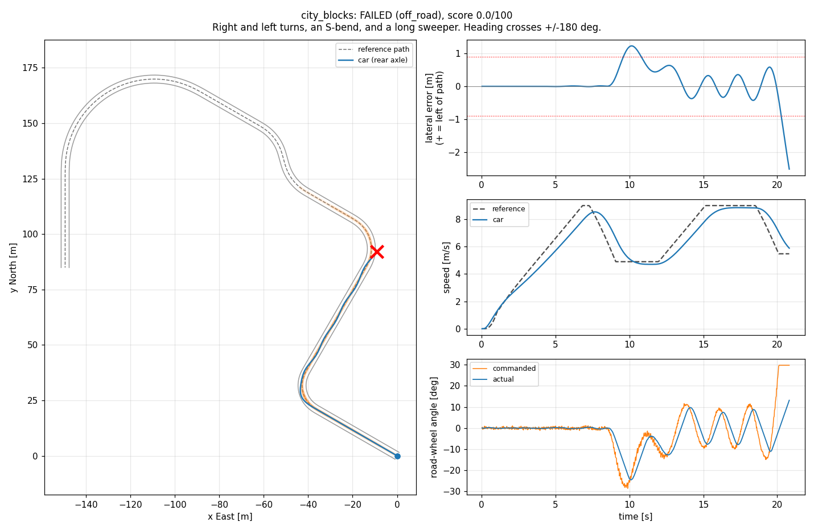

# Trajectory Tracking

**Level:** intermediate. **Time:** the guided core in an afternoon, stretch as long as you like.

**Make the car drive the plan.** Our mid planner publishes a `ReferenceTrajectory` 10 times a second. Something has to turn it into throttle, brake and steering 50 times a second, on a real car whose steering is slow, whose brakes lag, and whose GPS is noisy. On our car that something is an MPC. Here it is you.

This challenge tests control fundamentals: vehicle geometry, feedback and feedforward, and tuning with data. The stretch goes into what makes real cars hard: actuator delay, saturation, and a car you only approximately know.

> **Try each part yourself first.** Use AI tools to explain a concept or to help you debug, not to write your solution. The checkpoints tell you when you are right.

<p align="center"><br>
<em>After Part 1, with crude stand-ins for Parts 2 and 3, on <code>city_blocks</code>: the car weaves, falls behind the steering, and leaves the road. Parts 2 and 3 fix that.</em></p>

## Where this sits in our stack

```
HD map route --> mid planner --(ReferenceTrajectory, 10 Hz)--> [ YOUR CONTROLLER ] --(CarTBS, 50 Hz)--> drive-by-wire
                                                                      ^
                                                   CarState (localization)
```

The message types in `common/messages.py` mirror the ROS 2 messages we use on the car, with the same field names, units and signs.

## Setup

```bash
pip install -r ../requirements.txt     # numpy and matplotlib
python check.py                        # checkpoints: everything says TODO for now
python run.py                          # drives every scenario, writes plots to results/
```

You edit **`controller.py`**. Its `compute()` glue is already written: it calls one function per part and turns an acceleration and a road-wheel angle into a `CarTBS` for you. Until you write Parts 2 and 3, crude stand-ins are used so the car still drives (badly).

## Conventions (read these, they bite)

| Thing | Convention |
|---|---|
| World frame | Local ENU: `x` = East, `y` = North, meters |
| Heading `psi`, `yaw` | Radians, 0 = East, counter-clockwise positive. Wrap your angle differences. |
| `CarState` position | Center of the **rear axle** |
| Curvature, steering | Positive = turning **left** |
| `CarTBS.t` / `CarTBS.b` | Throttle 0 to 5 m/s² / brake **-10 to 0** m/s² |
| `CarTBS.s` | Steering **column** angle in degrees: road-wheel angle x 16.8 (the glue does this for you) |

## Part 1: where am I relative to the path?

**The idea.** Every controller starts by measuring the error. Find the closest point on the reference, then two numbers: how far you are to the side of the path (lateral error, positive when you are to its left) and how far your heading is off from the path's heading.

```
          left of the path is (-sin(yaw), cos(yaw))
                    ^
                    |  e_lat  (car is left of the path: positive)
     ---------------o------------------>  path, heading yaw
             closest point i
```

**Do this.** Write `path_errors(state, pts)` returning `(i, e_lat, e_yaw)`.

**Check it.** `python check.py part1`

**Explain in your write-up.** Why must `e_yaw` be wrapped to [-pi, pi)? Try it before you write Part 3 (the stand-in steering uses your `e_lat` and `e_yaw` directly): temporarily remove the wrap and run `python run.py --scenario hairpin`, whose heading crosses 180 degrees about 40 m in. What happens, and why? (Put the wrap back afterwards.)

## Part 2: speed

**The idea.** A PI controller on the speed error, plus the plan's own acceleration as feedforward. (If you did [Speed Control](../speed_control/), this is the same thing.)

**Do this.** Write `speed_accel(state, pts, i)`. The docstring warns about the two traps: starting from rest, and integral windup.

**Check it.** `python check.py part2` (it drives `stop_sign` for you).

**Explain in your write-up.** Your car probably stops a little short of each stop line. Look at `results/stop_sign.png` and explain why. (Fixing it is a stretch goal.)

## Part 3: steering with pure pursuit

**The idea.** Pick a goal point on the path a lookahead distance `ld` ahead, and steer along the circular arc that runs from your rear axle through it. Geometry gives the arc's curvature directly.

```
                          * goal point on the path, ld from the rear axle
                         /
                        /  ld
                       /
           alpha      /
    rear axle o------------->  car heading

    curvature of the arc through the goal point:  k = 2 sin(alpha) / D   (D = distance to the goal point, about ld)
    road-wheel angle for that curvature:          delta = atan(wheelbase * k)
```

**Do this.** Write `pure_pursuit(state, pts, i)`. Use `self.lookahead_min` and `self.lookahead_gain` (lookahead grows with speed).

**Check it.** `python check.py part3`. On a circle of radius R, pure pursuit should steer about `atan(wheelbase / R)`. (The check sets its own lookahead, so your tuning does not matter there.)

**Explain in your write-up.** What happens with a very short lookahead? A very long one? Why does pure pursuit cut the inside of corners?

## Part 4: put it together and tune

`python check.py part4` drives the four core scenarios. When they all pass, open the plots and tune: the lookahead, the speed gains, anything you like. Change one thing at a time and keep notes.

| Scenario | Set | What it tests |
|---|---|---|
| `stop_sign` | core | Launch from rest, speed tracking, stopping, holding, launching again |
| `city_blocks` | core | 12 m and 15 m radius turns, an S-bend, a long sweeper; the heading crosses +/-180 deg |
| `lane_change` | core | Double lane change at 10 m/s |
| `hairpin` | core | Two U-turns at radius 6.5 to 7 m, near the steering limits; the heading crosses 180 deg about 40 m in |
| `hill` | stretch | 8% climb, a stop halfway up, then an 8% descent (use `CarState.pitch`) |
| `late_stop` | stretch | 12 m/s cruise; stops that appear only 40 m and 28 m ahead |
| `recovery` | stretch | Start 1 m off the path, 12 deg off heading, at 6 m/s, straight into an S-bend |

To calibrate yourself: a straightforward version of the three parts completes every scenario and scores about 55 to 65 on the core. Good tuning and better stops get you into the 70s. Handling the steering delay gets 90+ (see the stretch). `python run.py --scenario hairpin` reruns one scenario (it updates the plot but not `summary.json`; run everything for your final results).

## Stretch goals (pick any)

1. **Stop on the line.** Use how far the trajectory's end is from you to brake exactly to it, creep up if you stop short, and hold the brake while waiting.
2. **Beat the actuator.** The steering responds 0.08 s late and then lags with a 0.20 s time constant, and cannot turn faster than 0.35 rad/s. Pure pursuit ignores that. Predict where the car will be when your command lands, and add the path's curvature as feedforward (a car turning with curvature `k` needs `atan(wheelbase * k)` just to stay on the path).
3. **Robustness.** `python run.py --perturb 5` runs every scenario on 5 cars with different delays, lags, steering offsets and understeer. A controller tuned to the edge of the nominal car will fall over.
4. **System identification.** `data/steering_test.csv` is a steering test on a car whose steering is *not* the nominal one (three runs at 3, 6 and 9 m/s with steps and a chirp; columns `segment_speed_mps, t, speed_mps, cmd_column_deg, column_sensor_deg, yaw_rate_radps`). Estimate its steering delay, time constant, rate limit, alignment offset and understeer gradient, with plots of your fits. To drive your controller on the car you identified, write your estimates to a JSON file, for example `{"steer_delay": 0.1, "steer_tau": 0.25, "steer_rate_max": 0.3, "steer_offset": 0.005, "understeer": 0.004}`, and run `python run.py --plant-params my_car.json`. We also run your controller on that test car when grading: it should do well on both the nominal car and that one.
5. **A different car.** `python run.py --backend chrono` runs the scenarios on Chrono's multibody `Sedan` (real tires and suspension). Needs `conda install -c conda-forge -c projectchrono pychrono`. Tell us what changed.
6. **An MPC**, like the real one, or a **ROS 2** node that wraps your controller.

## The car

Our best estimates of the real car, and what the simulator uses by default:

| Property | Nominal value |
|---|---|
| Wheelbase | 2.67 m |
| Max road-wheel angle | 0.52 rad (about 30 deg), tightest radius about 4.7 m |
| Steering | 0.08 s delay, then a 0.20 s lag, rate-limited to 0.35 rad/s at the road wheel |
| Throttle / brake | 0.10 s delay, then a 0.30 s lag |
| Resistance | 0.15 m/s² rolling, plus a little aero drag |
| Understeer | 0.0035 rad of extra road-wheel angle per m/s² of lateral acceleration |
| Hill hold | The car never rolls backward |
| Localization noise (1 sigma) | 2 cm position, 0.17 deg heading, 0.05 m/s speed |

## The reference trajectory

* Points every 0.5 m, from at or just behind the car to 50 m ahead, with `x, y, yaw, velocity_mps, acceleration_mps2, curvature, relative_time_sec`. A new one arrives every 0.1 s (`ref.stamp`).
* The path's `yaw` values are continuous along the trajectory, so they can go past +/-180 deg, while `state.psi` is always in [-180, 180) deg. Wrap every difference.
* The speed profile respects the speed limit, a 2.0 m/s² lateral acceleration limit in curves, and comfortable accel (1.5 m/s²) and decel (2.0 m/s²).
* **Stops.** When the planner wants you to stop, the trajectory **ends at the stop point** with zero speed. Once the car has been stopped within 3 m of that point for the hold time, the stop is released and the trajectory continues.

## Scoring

A run **fails** (score 0) if the car gets more than 2.5 m from the path, does not finish within 1.5x the nominal time plus 15 s, or your code raises an error or returns something that is not a finite number. Otherwise it earns up to 100 points, linear between "full" and "zero":

| Metric | Points | Full | Zero |
|---|---|---|---|
| RMS lateral error | 20 | 0.03 m | 0.30 m |
| Max lateral error | 15 | 0.10 m | 0.80 m |
| RMS speed error (not counted in the last 2 m before a stop) | 20 | 0.10 m/s | 0.70 m/s |
| Mean stop position error (every stop, including the end of the route) | 15 | 0.10 m | 1.00 m (rolling through a stop = 0) |
| RMS longitudinal jerk | 10 | 1.0 m/s³ | 4.0 m/s³ |
| RMS road-wheel steering rate | 10 | 0.03 rad/s | 0.15 rad/s |
| Finish time / nominal time | 10 | 1.05 | 1.40 |

`ms_p95` in the scoreboard is your 95th percentile compute time per call. The real loop runs at 50 Hz, so keep it well under 20 ms. We also run your controller on perturbed cars and other noise seeds.

## What to put in your write-up

Along with the general items in the [top-level README](../README.md#what-to-submit): your answers to the "explain" questions, each with the plot that shows it; your final tuning and how you chose it; your scoreboard; and anything you tried from the stretch.

## Tips

* Plot first. `results/*.png` shows commanded vs actual steering: when they disagree, the actuator is in the way.
* Wrap every angle difference to [-pi, pi).
* Throttle and brake are separate channels, and the brake is negative.
* When the car is stopped, pure pursuit's goal point can sit right on top of you and the steering chatters. Hold the steering still while you are stopped.
